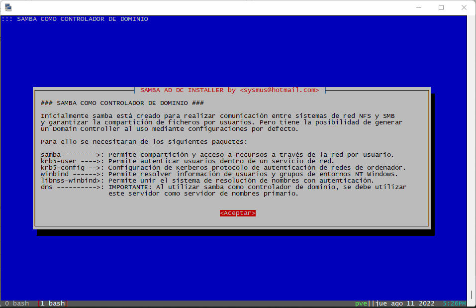
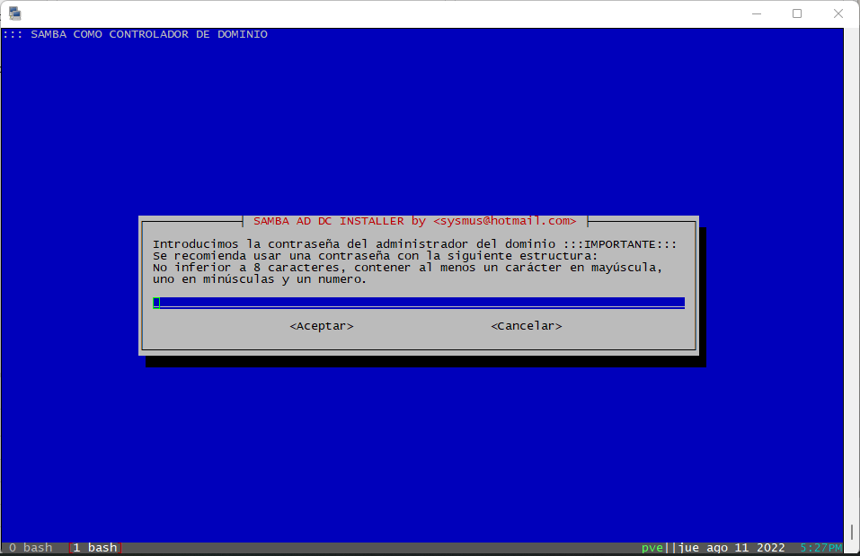
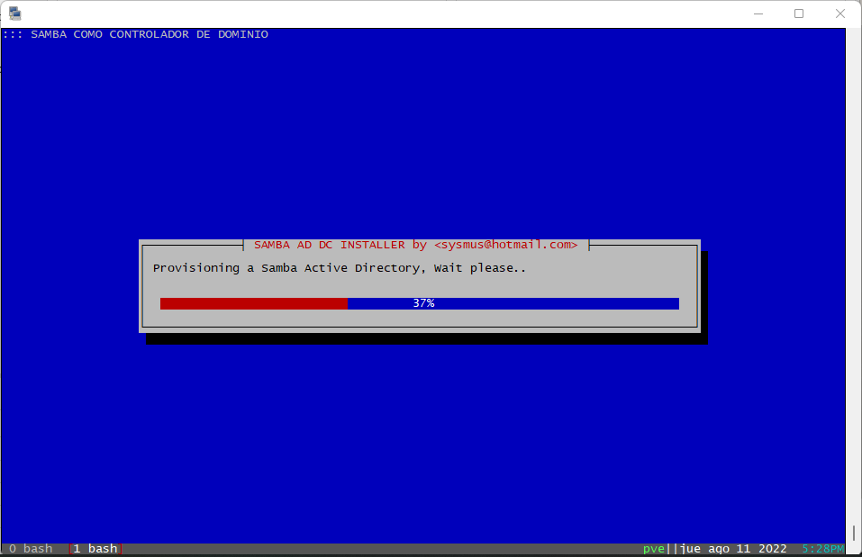
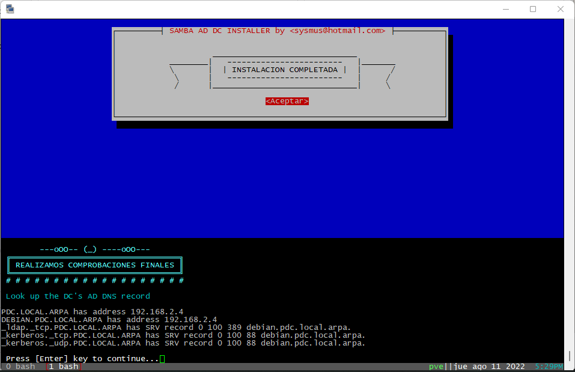
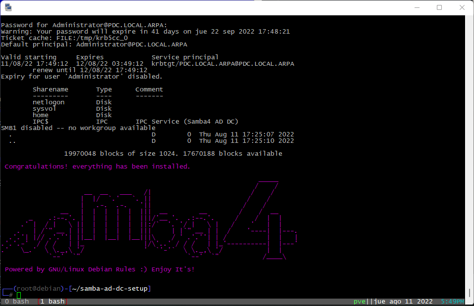

- 👋 Hi, I’m @sysmus <sysmus@hotmail.com>
- 👀 I’m interested in LINUX, MAC, BSD Systems
- 🌱 I’m currently learning Drive a spaceship to go to next Centauri
- 💞️ I’m looking to collaborate on Extract gold from the indian ocean
- 📫 How to reach me It's easy, call me on Stratosphere!

<!---
sysmus/sysmus is a ✨ special ✨ repository because its `README.md` (this file) appears on your GitHub profile.
You can click the Preview link to take a look at your changes.
--->

# SAMBA AD DC for Debian Based Systems

## For Debian Based Systems
*Samba* es un software gratuito de c&oacute;digo abierto que proporciona una interoperabilidad est&aacute;ndar entre los sistemas operativos Windows, Linux y Unix. *Samba* funciona como un servidor de archivos e impresi&oacute;n independiente para clientes de Windows y Linux a trav&eacute;s del conjunto de protocolos SMB / CIFS o puede actuar como un controlador de dominio de Active Directory.

### Este SCRIPT realiza una instalacion completa de Samba4 en modo Controlador de Dominio.

#### Antes de ejecturar el script revise la configuracion en su servidor y 
#### utilice las siguientes recomendaciones:

1. Seleccione un nombre de host para su AD DC.
2. No utilice términos exclusivos de NT4 como nombre de host, como PDC o BDC. Estos modos no existen en un AD y causan confusión.
3. Seleccione un dominio DNS para su bosque AD. El nombre también se usará como el dominio AD Kerberos.
4. Asegúrese de aprovisionar el AD mediante un dominio DNS que no será necesario cambiar. Samba no admite el cambio de nombre de la zona AD DNS y el dominio Kerberos. No use .local para el TLD, esto lo usa Avahi.
5. Utilice una dirección IP estática en el DC.
6. Para obtener información adicional, consulte la guia de samba https://wiki.samba.org/index.php/Setting_up_Samba_as_an_Active_Directory_Domain_Controller
7. Debe configurar como DNS primario al propio servidor usando la IP de localhost 127.0.0.1 en su archivo /etc/resolv.conf
8. Deshabilite las herramientas, como resolvconf, que actualizan automáticamente su archivo de configuración de resolución de DNS /etc/resolv.conf. Los AD DC y los miembros del dominio deben usar un servidor DNS que pueda resolver las zonas AD DNS.

>Este script fue testeado con excelentes resultados y puesto en producción en diferentes ambientes sistematizados, como por ejemplo:
>    - Máquinas virtuales en Proxmox, VMware, VirtualBox, Hyper-V
>    - Contenedores LXC usados en Proxmox VE v7/8
>    - Servidores usados en pruebas y producción
>    - - HPE ProLiant DL380 Gen10 server
>    - - DELL PowerEdge R720/830

## Enjoy It!

#### Do you enjoy my work? send me a beer!

sysmus@hotmail.com

